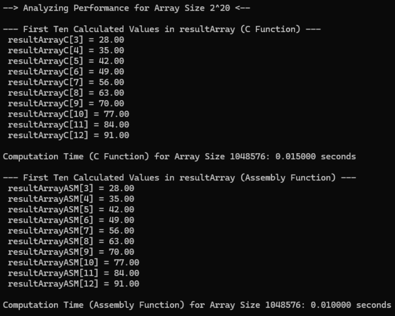
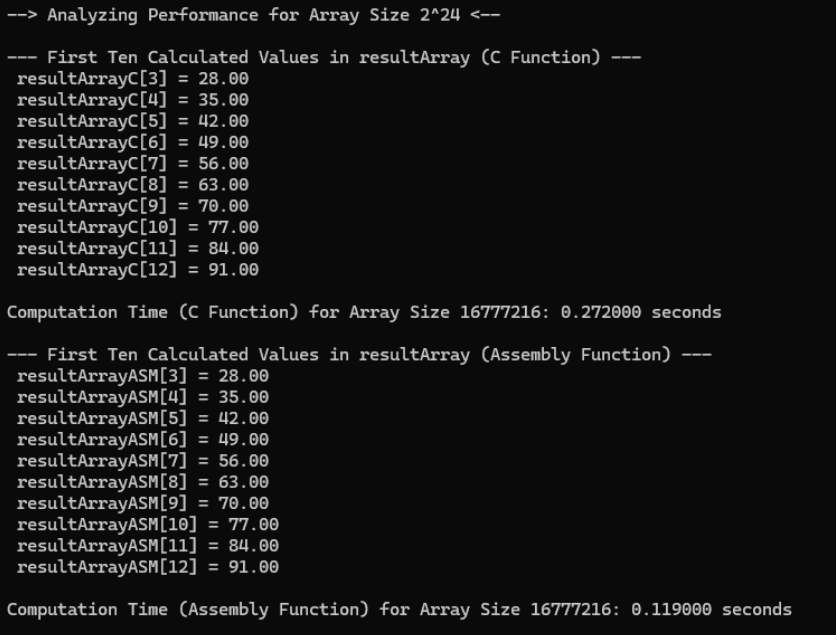
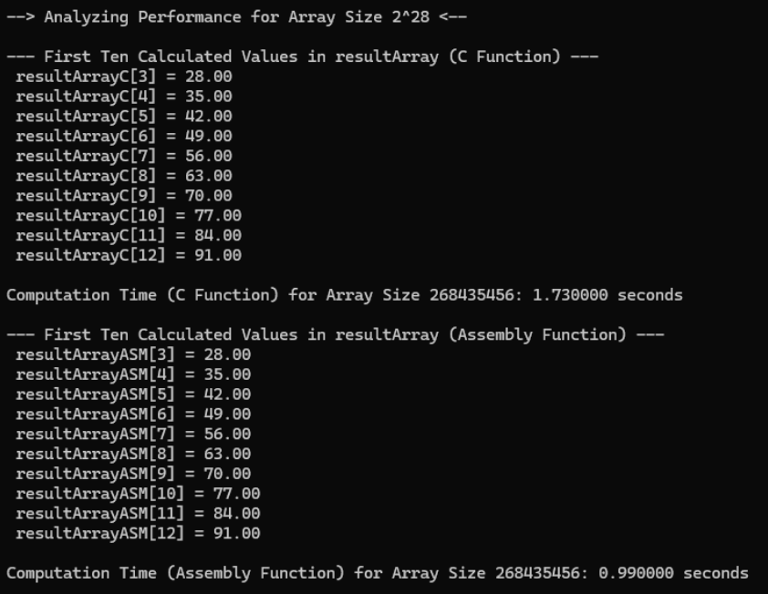
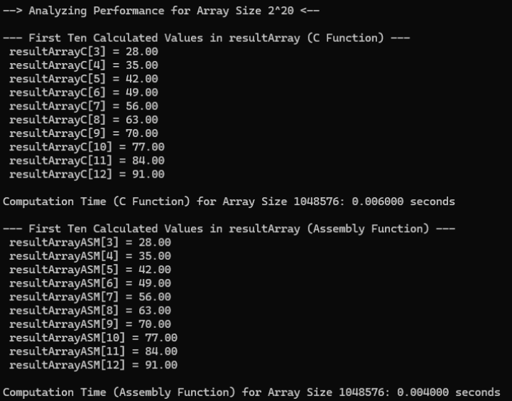
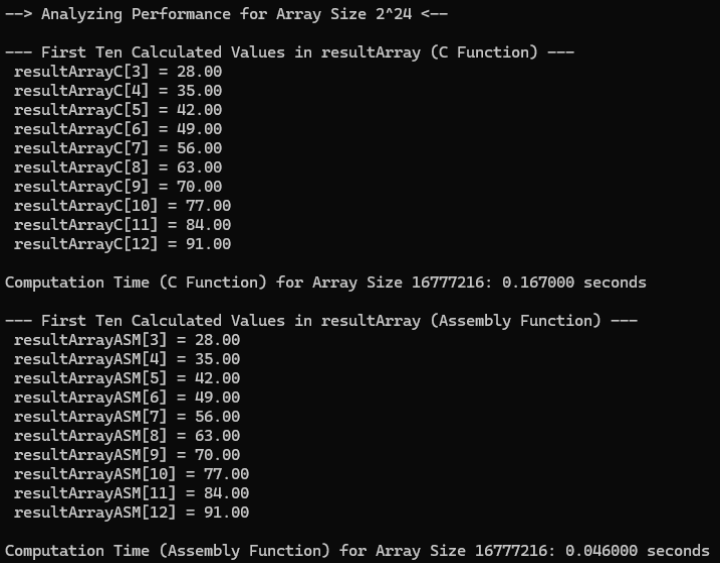
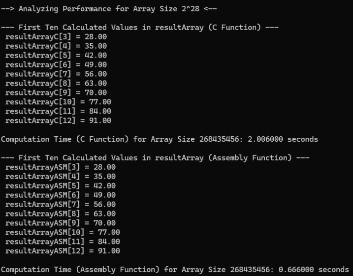

# 1D Stencil Operation in C and x86-64 Assembly: Performance Analysis

Authors:
CUALES, Bianca Mari
PASCUAL, Isaiah Sam

You may access the documentation through this link:
https://docs.google.com/document/d/1FDU3OLeo8lv1L1IWFCLyK1UCsXcIH_gj-kfMLl1QzNo/edit?usp=sharing

# DATA ANALYSIS

In our data analysis, we're comparing the program's runtime in release and debug modes. By running it 30 times, 15 in each mode, and noting execution times for specific functions across data sizes of 2^20, 2^24, and 2^28, we aim to pinpoint performance differences and optimize efficiency.

## Initial Values

### Debug Mode

| Size | Kernel | Execution time each run for Debug Mode |
|------|--------|---------------------------------------|
| 2^20 (1048576)  | C   | 0.013000, 0.015000, 0.019000, 0.011000, 0.022000, 0.014000, 0.016000, 0.020000, 0.012000, 0.021000, 0.017000, 0.018000, 0.013500, 0.016500, 0.020500 |
| 2^20 (1048576)  | ASM | 0.018000, 0.010000, 0.013000, 0.006000, 0.015000, 0.013000, 0.015000, 0.019000, 0.011000, 0.022000, 0.008000, 0.017000, 0.014000, 0.009000, 0.020000 |
| 2^24 (16777216) | C   | 0.240000, 0.272000, 0.112000, 0.225000, 0.166000, 0.250000, 0.280000, 0.130000, 0.210000, 0.190000, 0.260000, 0.150000, 0.200000, 0.175000, 0.220000 |
| 2^24 (16777216) | ASM | 0.128000, 0.272000, 0.059000, 0.163000, 0.089000, 0.140000, 0.260000, 0.075000, 0.150000, 0.100000, 0.135000, 0.180000, 0.095000, 0.170000, 0.110000 |
| 2^28 (268435456)| C   | 1.884000, 1.730000, 1.616000, 1.833000, 1.666000, 1.750000, 1.800000, 1.640000, 1.700000, 1.680000, 1.760000, 1.820000, 1.790000, 1.770000, 1.850000 |
| 2^28 (268435456)| ASM | 0.930000, 0.990000, 0.721000, 1.572000, 0.979000, 0.950000, 1.020000, 0.760000, 1.500000, 1.000000, 0.780000, 1.550000, 0.800000, 1.030000, 1.580000 |

**Average Execution Time:**

- **2^20**: C: 0.01857, ASM: 0.0138
- **2^24**: C: 0.2092, ASM: 0.1392
- **2^28**: C: 1.7433, ASM: 1.0193

### Release Mode

| Size | Kernel | Execution time each run for Release Mode |
|------|--------|-----------------------------------------|
| 2^20 (1048576)  | C   | 0.006000, 0.006000, 0.006000, 0.008000, 0.006000, 0.006000, 0.008000, 0.010000, 0.007000, 0.008000, 0.008000, 0.010000, 0.007000, 0.001000, 0.006000 |
| 2^20 (1048576)  | ASM | 0.004000, 0.003000, 0.002000, 0.002000, 0.003000, 0.003000, 0.003000, 0.002000, 0.004000, 0.002000, 0.004000, 0.003000, 0.002000, 0.003000, 0.002000 |
| 2^24 (16777216) | C   | 0.167000, 0.092000, 0.092000, 0.085000, 0.089000, 0.092000, 0.085000, 0.085000, 0.089000, 0.160000, 0.085000, 0.078000, 0.088000, 0.050000, 0.060000 |
| 2^24 (16777216) | ASM | 0.046000, 0.033000, 0.034000, 0.037000, 0.031000, 0.034000, 0.037000, 0.046000, 0.033000, 0.046000, 0.046000, 0.083000, 0.076000, 0.053000, 0.037000 |
| 2^28 (268435456)| C   | 2.006000, 1.731000, 1.384000, 1.503000, 1.543000, 1.731000, 1.384000, 2.006000, 2.005000, 2.023000, 1.384000, 2.006000, 2.005500, 1.384000, 1.503000 |
| 2^28 (268435456)| ASM | 0.666000, 0.847000, 0.493000, 0.561000, 0.609000, 0.847000, 0.333000, 0.230000, 0.121000, 0.493000, 0.561000, 0.847000, 0.493000, 0.561000, 0.609000 |

**Average Execution Time:**

- **2^20**: C: 0.006867, ASM: 0.002800
- **2^24**: C: 0.093133, ASM: 0.044800
- **2^28**: C: 1.706567, ASM: 0.551400

## Performance Analysis

The Assembly implementation showcases superior performance over the C implementation across all tested array sizes. This is particularly noticeable in larger data sets (e.g., 2^28), where the execution time for Assembly is significantly less than that for C. This suggests that low-level optimizations in Assembly can lead to substantial performance improvements, especially in compute-intensive applications like the stencil operation.

## Observations

Both implementations produce identical output, confirming the correctness of the stencil computation across different programming languages and optimization levels. The detailed outputs, alongside the computation times, further validate the efficiency and accuracy of the implemented stencil logic.

## Conclusion

The analysis underscores the effectiveness of Assembly language for performance-critical operations, offering a deeper insight into how low-level programming can be leveraged to optimize computational tasks. Despite the complexity of Assembly language, its use in applications requiring intensive data processing can significantly enhance performance, making it a valuable skill set in system programming and performance optimization.
